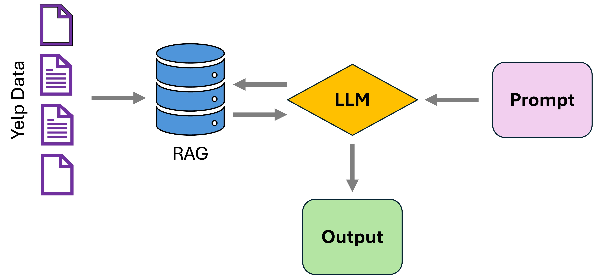

# Yelp Review Sumamrizer

---

In this project, we built an AI application that summarizes the Yelp reviews for various companies.

## Data

This dataset is a subset of Yelp's businesses, reviews, and user data. It was originally assembled for the Yelp Dataset Challenge, which offered students an opportunity to conduct research and/or analysis on Yelp's data. For reference, the data can be found [here](https://www.kaggle.com/datasets/yelp-dataset/yelp-dataset/data?select=yelp_academic_dataset_review.json)

## Our Project

As mentioned previously, the goal of this project is to develop an AI application that summarizes the reviews of various companies. A schematic can be seen below:

To accomplish this project, we:

1. Gathered the Yelp Data
2. Preprocessed the data
3. Built a RAG
4. Designed a prompt that:
   1. queries the database for relevant entries
   2. encorporates these entries into its context
   3. returns a summary of the reviews as well as some general sentiments
5. Built a web app using Gradio
6. Deployed the web app to the cloud
